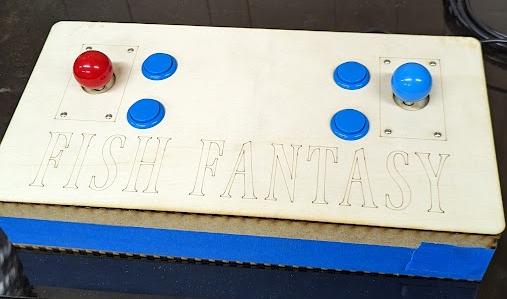
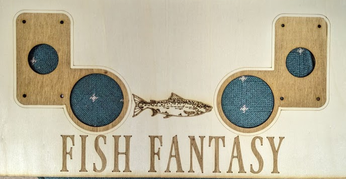

# Rhythmstick
 An open source and open design joystick designed for playing rhythm games like Theatrhythm.

Project files are designed to use a Laser Cutter with Lightburn software.

Prototype #0001 - Designed for Sanwa joysticks with 20mm + 6mm (26mm total) standoffs on the joystick and sized for 30mm screw style buttons 

Prototype #0002 - Designed for Sanwa joysticks with 20mm + 6mm (26mm total) standoffs on the joystick and sized for 60mm screw style dome buttons 

3d print the octagonal JLF gate for better acuracy when playing. https://cults3d.com/en/3d-model/tool/sanwa-joystick-gate-remix

2026/02/28 - Added version 1 of the Theatrythm All Star Carnival Arcade joystick. This is a vibe-CADed attempt as I do not have the exact measurements and just used images from the manual to guesstimate sizes.

Full build guide and list of materials will be posted later.
